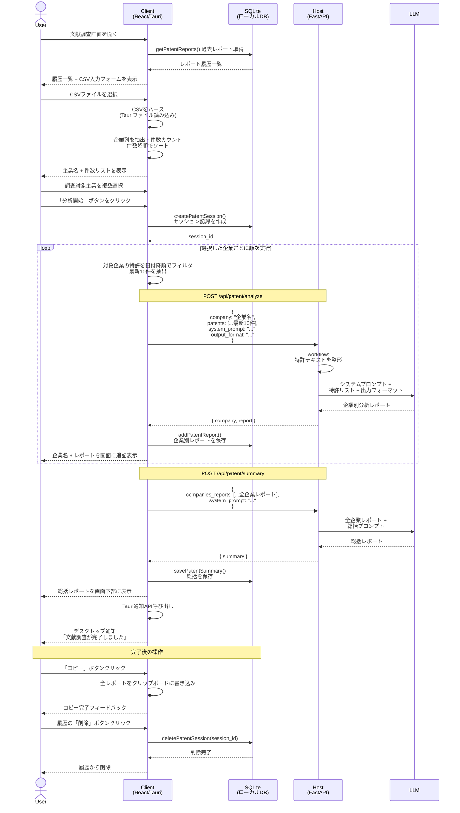

```mermaid
sequenceDiagram
    actor User
    participant Client as Client<br/>(React/Tauri)
    participant SQLite as SQLite<br/>(ローカルDB)
    participant Host as Host<br/>(FastAPI)
    participant LLM

    %% ─── 画面初期表示 ───────────────────────────────────────
    User->>Client: 文献調査画面を開く
    Client->>SQLite: getPatentReports() 過去レポート取得
    SQLite-->>Client: レポート履歴一覧
    Client-->>User: 履歴一覧 + CSV入力フォームを表示

    %% ─── CSV読み込み・企業抽出 ──────────────────────────────
    User->>Client: CSVファイルを選択
    Client->>Client: CSVをパース<br/>(Tauriファイル読み込み)
    Client->>Client: 企業列を抽出・件数カウント<br/>件数降順でソート
    Client-->>User: 企業名 + 件数リストを表示

    %% ─── 企業選択 ────────────────────────────────────────────
    User->>Client: 調査対象企業を複数選択
    User->>Client: 「分析開始」ボタンをクリック
    Client->>SQLite: createPatentSession()<br/>セッション記録を作成
    SQLite-->>Client: session_id

    %% ─── 企業ごとの分析ループ ────────────────────────────────
    loop 選択した企業ごとに順次実行

        Client->>Client: 対象企業の特許を日付降順でフィルタ<br/>最新10件を抽出

        Note over Client,Host: POST /api/patent/analyze
        Client->>Host: {<br/>  company: "企業名",<br/>  patents: [...最新10件],<br/>  system_prompt: "...",<br/>  output_format: "..."<br/>}

        Host->>Host: workflow:<br/>特許テキストを整形
        Host->>LLM: システムプロンプト +<br/>特許リスト + 出力フォーマット
        LLM-->>Host: 企業別分析レポート
        Host-->>Client: { company, report }

        Client->>SQLite: addPatentReport()<br/>企業別レポートを保存
        Client-->>User: 企業名 + レポートを画面に追記表示

    end

    %% ─── 総括レポート生成 ────────────────────────────────────
    Note over Client,Host: POST /api/patent/summary
    Client->>Host: {<br/>  companies_reports: [...全企業レポート],<br/>  system_prompt: "..."<br/>}

    Host->>LLM: 全企業レポート +<br/>総括プロンプト
    LLM-->>Host: 総括レポート
    Host-->>Client: { summary }

    Client->>SQLite: savePatentSummary()<br/>総括を保存
    Client-->>User: 総括レポートを画面下部に表示

    %% ─── 完了通知 ────────────────────────────────────────────
    Client->>Client: Tauri通知API呼び出し
    Client-->>User: デスクトップ通知<br/>「文献調査が完了しました」

    %% ─── 操作（コピー・削除） ────────────────────────────────
    Note over User,SQLite: 完了後の操作

    User->>Client: 「コピー」ボタンクリック
    Client->>Client: 全レポートをクリップボードに書き込み
    Client-->>User: コピー完了フィードバック

    User->>Client: 履歴の「削除」ボタンクリック
    Client->>SQLite: deletePatentSession(session_id)
    SQLite-->>Client: 削除完了
    Client-->>User: 履歴から削除
```