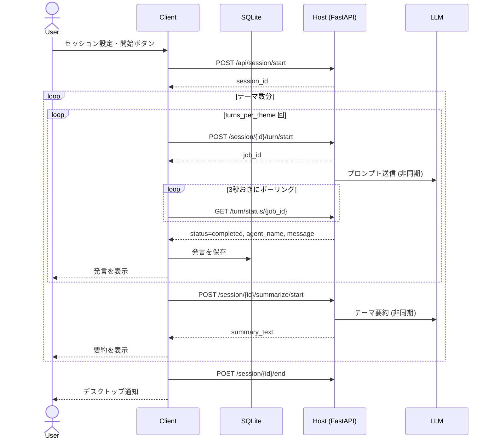
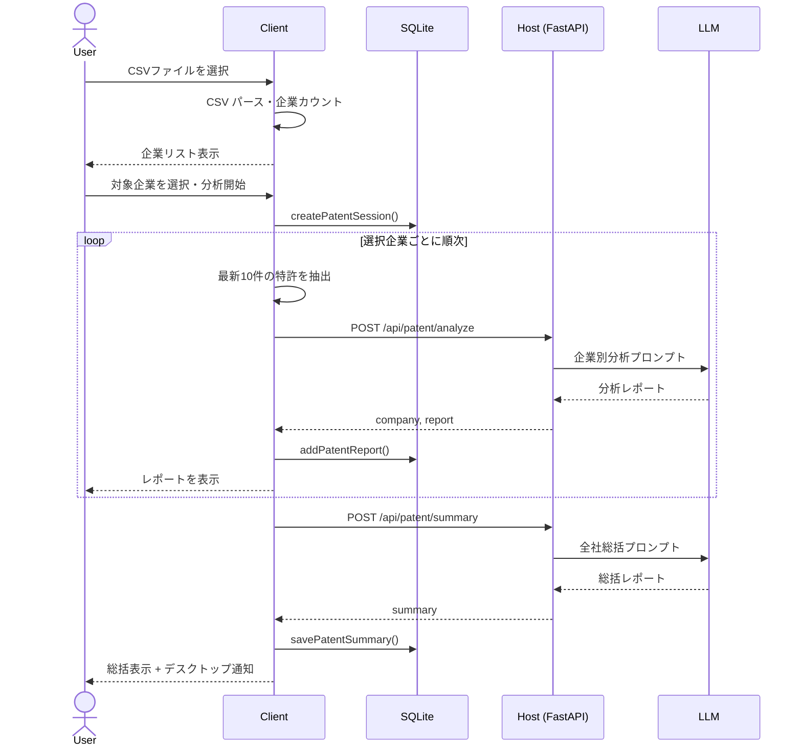
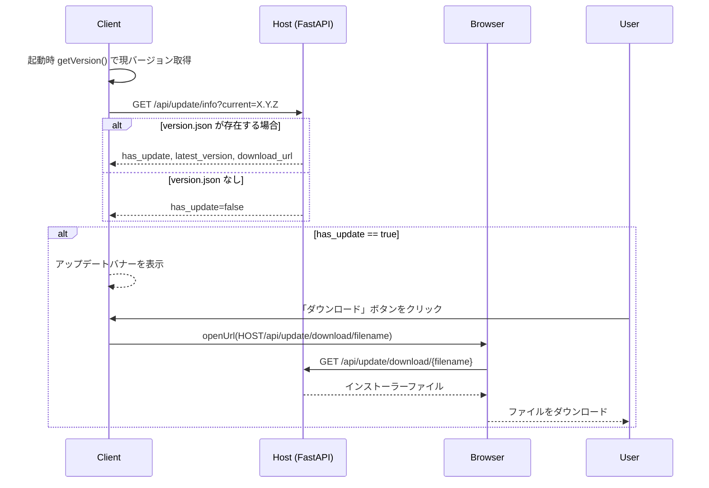

# システム仕様書

## 目次
1. [プロジェクト概要](#1-プロジェクト概要)
2. [アーキテクチャ](#2-アーキテクチャ)
3. [データベーススキーマ (Client SQLite)](#3-データベーススキーマ-client-sqlite)
4. [アプリケーション設定 (AppSettings)](#4-アプリケーション設定-appsettings)
5. [API仕様](#5-api仕様)
6. [ワークフロー仕様](#6-ワークフロー仕様)
7. [処理フロー (シーケンス図)](#7-処理フロー-シーケンス図)

---

## 1. プロジェクト概要

複数のAIエージェントに特定テーマについて議論させるデスクトップアプリケーション。
特許CSV を入力して企業の技術動向を調査するレポート生成機能も持つ。

**技術スタック:**

| レイヤー | 技術 |
|---------|------|
| デスクトップUI | Tauri v2 + React 19 + TypeScript |
| スタイリング | Tailwind CSS v4 |
| ローカルDB | SQLite (tauri-plugin-sql) |
| バックエンド | FastAPI + LangChain |
| LLM | OpenAI互換 API (ローカルLLM対応) |
| ベクトルDB | Qdrant (Docker) |

---

## 2. アーキテクチャ

```
+---------------------------------------------------------+
|  Client (Windows デスクトップアプリ)                     |
|  +----------------+  +------------------------------+   |
|  | React / Vite   |  | SQLite (tauri-plugin-sql)    |   |
|  |  (UI 描画)     |  | - 議論履歴                    |   |
|  |                |  | - 特許調査履歴                 |   |
|  |                |  | - ペルソナ / タスク設定         |   |
|  +-------+--------+  +------------------------------+   |
|          | HTTP (tauri-plugin-http)                     |
+----------+----------------------------------------------+
           |
+----------+-------------------------------------------+
|  Host (Ubuntu サーバー)    FastAPI                    |
|          |                                            |
|  +-------+--------+  +---------------------------+   |
|  | API Routers    |  | Workflow                  |   |
|  | /api/session   |  | turn_runner               |   |
|  | /api/patent    |  | input_builder             |   |
|  | /api/update    |  | history_compressor        |   |
|  | /api/settings  |  | summarizer                |   |
|  | /api/rag       |  +----------+----------------+   |
|  +----------------+             |                    |
|                           +-----+-----+  +--------+  |
|  client_dist/             |    LLM    |  | Qdrant |  |
|  +-version.json           | (OpenAI   |  | (RAG)  |  |
|  +-*.exe / *.AppImage     |  互換)    |  |        |  |
+---------------------------+-----------+--+--------+--+
```

**責務分担:**

| 項目 | Client | Host |
|------|--------|------|
| UIレンダリング | O | - |
| データ永続化 | SQLite | - |
| セッション状態 | - | インメモリ |
| LLM呼び出し | - | O |
| RAG検索 | - | O |
| クライアント配布 | - | O |
| 設定保存 | DB (ローカル設定) | settings.json |

---

## 3. データベーススキーマ (Client SQLite)

### 議論機能

```sql
CREATE TABLE personas (
    id TEXT PRIMARY KEY,
    name TEXT NOT NULL,
    role TEXT NOT NULL,
    pre_info TEXT DEFAULT '',
    rag_enabled INTEGER DEFAULT 0,
    rag_tag TEXT DEFAULT ''
);

CREATE TABLE tasks (
    id TEXT PRIMARY KEY,
    description TEXT NOT NULL
);

CREATE TABLE sessions (
    id TEXT PRIMARY KEY,
    title TEXT NOT NULL,
    created_at DATETIME DEFAULT CURRENT_TIMESTAMP
);

CREATE TABLE messages (
    id TEXT PRIMARY KEY,
    session_id TEXT NOT NULL REFERENCES sessions(id) ON DELETE CASCADE,
    theme TEXT NOT NULL,
    agent_name TEXT NOT NULL,
    content TEXT NOT NULL,
    turn_order INTEGER NOT NULL,
    created_at DATETIME DEFAULT CURRENT_TIMESTAMP
);

CREATE TABLE theme_entries (
    id TEXT PRIMARY KEY,
    text TEXT NOT NULL,
    persona_ids TEXT DEFAULT '[]',   -- JSON array
    output_format TEXT DEFAULT '',
    sort_order INTEGER DEFAULT 0
);

CREATE TABLE session_config (
    key TEXT PRIMARY KEY,
    value TEXT NOT NULL
);
```

### 特許調査機能

```sql
CREATE TABLE patent_sessions (
    id TEXT PRIMARY KEY,
    title TEXT NOT NULL,
    created_at DATETIME DEFAULT CURRENT_TIMESTAMP
);

CREATE TABLE patent_reports (
    id TEXT PRIMARY KEY,
    session_id TEXT NOT NULL REFERENCES patent_sessions(id) ON DELETE CASCADE,
    company TEXT NOT NULL,
    report TEXT NOT NULL,
    sort_order INTEGER DEFAULT 0
);

CREATE TABLE patent_summaries (
    id TEXT PRIMARY KEY,
    session_id TEXT NOT NULL REFERENCES patent_sessions(id) ON DELETE CASCADE,
    summary TEXT NOT NULL
);
```

---

## 4. アプリケーション設定 (AppSettings)

Host の `settings.json` で永続化される設定一覧。
Client の Settings 画面から `/api/settings` 経由で読み書き可能。

| キー | 型 | デフォルト | 説明 |
|------|-----|-----------|------|
| `turns_per_theme` | int | 5 | 1テーマあたりの発言ターン数 |
| `default_output_format` | str | (テンプレート) | エージェント発言フォーマット |
| `agent_prompt_template` | str | (テンプレート) | エージェントへのシステムプロンプト |
| `summary_prompt_template` | str | (テンプレート) | テーマ要約プロンプト |
| `max_history_tokens` | int | 50000 | 会話履歴の最大トークン数 (0=無制限) |
| `recent_history_count` | int | 5 | 圧縮しない直近の会話数 |
| `patent_company_column` | str | "出願人" | CSVの企業名列名 |
| `patent_content_column` | str | "請求項" | CSVの特許内容列名 |
| `patent_date_column` | str | "出願日" | CSVの日付列名 |

LLM接続情報 (`LLM_IP`, `LLM_PORT`, `LLM_MODEL`, `LLM_API_KEY`, `LLM_TEMPERATURE`) は
Host の `.env` のみで管理し、APIには公開しない。

---

## 5. API仕様

### 5.1 議論セッション API `/api/session`

| Method | Path | 説明 |
|--------|------|------|
| POST | `/start` | セッション開始、インメモリに状態を作成 |
| POST | `/{id}/turn/start` | 1ターン実行開始 (非同期ジョブ) |
| GET | `/{id}/turn/status/{job_id}` | ターン実行状況ポーリング |
| POST | `/{id}/summarize/start` | テーマ要約開始 (非同期ジョブ) |
| GET | `/{id}/summarize/status/{job_id}` | 要約状況ポーリング |
| POST | `/{id}/end` | セッション終了・インメモリ状態破棄 |

**POST `/start` リクエスト例:**
```json
{
  "themes": [
    { "theme": "AIが社会に与える影響", "persona_ids": [], "output_format": "" }
  ],
  "personas": [
    { "id": "p1", "name": "楽観主義者", "role": "AIの可能性を信じる研究者", "pre_info": "" }
  ],
  "tasks": [
    { "id": "t1", "description": "AIが雇用に与える影響を分析する" }
  ],
  "history": [],
  "turns_per_theme": 5,
  "common_theme": "2030年のテクノロジー",
  "pre_info": "事前調査資料の内容..."
}
```

**GET `/{id}/turn/status/{job_id}` レスポンス例:**
```json
{
  "status": "completed",
  "agent_name": "楽観主義者",
  "message": "AIは新たな雇用を創出します...",
  "theme": "AIが社会に与える影響",
  "is_theme_end": false,
  "all_themes_done": false
}
```

### 5.2 設定 API `/api/settings`

| Method | Path | 説明 |
|--------|------|------|
| GET | `/` | 現在の AppSettings を取得 |
| PUT | `/` | AppSettings を更新・settings.json に保存 |
| GET | `/health` | サーバー・LLM 接続確認 |

### 5.3 特許調査 API `/api/patent`

| Method | Path | 説明 |
|--------|------|------|
| POST | `/analyze` | 1企業分の特許を分析してレポートを返す |
| POST | `/summary` | 全企業レポートをまとめた総括を返す |

**POST `/analyze` リクエスト例:**
```json
{
  "company": "サンプル技術株式会社",
  "patents": [
    { "content": "深層学習を用いた画像認識システム", "date": "2024-03-15" }
  ],
  "system_prompt": "",
  "output_format": ""
}
```

### 5.4 アップデート配布 API `/api/update`

| Method | Path | 説明 |
|--------|------|------|
| GET | `/info?current=X.Y.Z&platform=windows` | 最新バージョン情報を返す |
| GET | `/download/{filename}` | インストーラーファイルをダウンロード |

**GET `/info` レスポンス例:**
```json
{
  "latest_version": "1.2.0",
  "current_version": "0.1.0",
  "has_update": true,
  "release_notes": "特許調査機能を追加",
  "download_url": "/api/update/download/client_1.2.0_x64-setup.exe",
  "filename": "client_1.2.0_x64-setup.exe"
}
```

### 5.5 RAG API `/api/rag`

| Method | Path | 説明 |
|--------|------|------|
| POST | `/init` | 指定タグのコレクションを初期化 |
| POST | `/add` | テキストをベクトル化して追加 |
| GET | `/status/{job_id}` | 追加ジョブのポーリング |

---

## 6. ワークフロー仕様

### 6.1 会話履歴管理

エージェントへ渡す会話履歴は以下のロジックで管理される:

```
全会話履歴 (session.history)
  |
  v estimate_tokens() でトークン数推定 (日本語: 1トークン ≈ 2文字)
  |
  +--[max_history_tokens 以下]--> そのまま全件渡す
  |
  +--[超過]--> 圧縮処理:
       直近 recent_history_count 件はそのまま保持
       それより前の発言を LLM で要約 -> [会話要約] エントリに置き換え
```

テーマ完了時の要約は `session.summary_memory` に蓄積され、
次テーマのエージェントが `previous_summaries` として参照できる。

### 6.2 特許調査ワークフロー

```
CSV入力 -> 企業抽出 -> 件数カウント -> 企業選択
  |
  v
企業ごとに順次処理:
  - 当該企業の特許を日付降順でソート -> 最新10件を選択
  - POST /api/patent/analyze -> LLMが分析レポートを生成
  - 結果を即座に画面表示 + SQLite に保存
  |
  v
全企業完了後:
  - 全レポートを POST /api/patent/summary -> 総括レポートを生成
  - デスクトップ通知を送信
```

### 6.3 エージェントプロンプト変数

`agent_prompt_template` で使用できる変数:

| 変数 | 内容 |
|------|------|
| `{role}` | ペルソナの役割 |
| `{name}` | ペルソナの名前 |
| `{task}` | 割り当てタスク |
| `{query}` | 今回のテーマ (共通テーマ + テーマ) |
| `{pre_info_section}` | 事前情報 (セッション + ペルソナ固有) |
| `{rag_section}` | RAG検索結果 |
| `{history}` | 会話履歴 (圧縮済み) |
| `{previous_summaries}` | 過去テーマの要約一覧 |
| `{output_format}` | 出力フォーマット指定 |

---

## 7. 処理フロー (シーケンス図)

### 7.1 議論セッション (起動〜完了)



### 7.2 特許調査



### 7.3 クライアントのアップデートチェック


