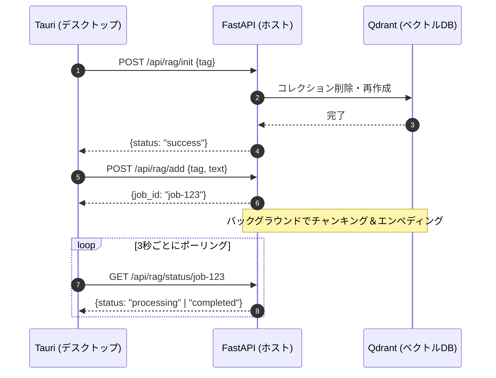
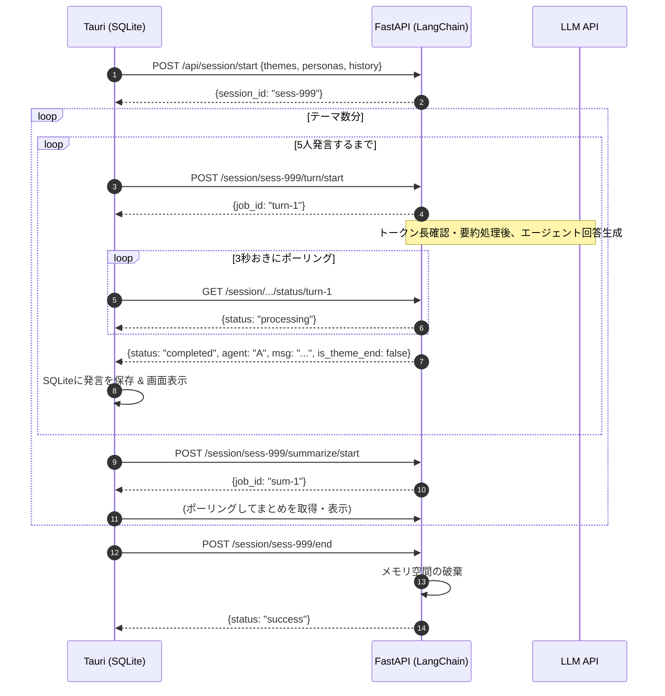
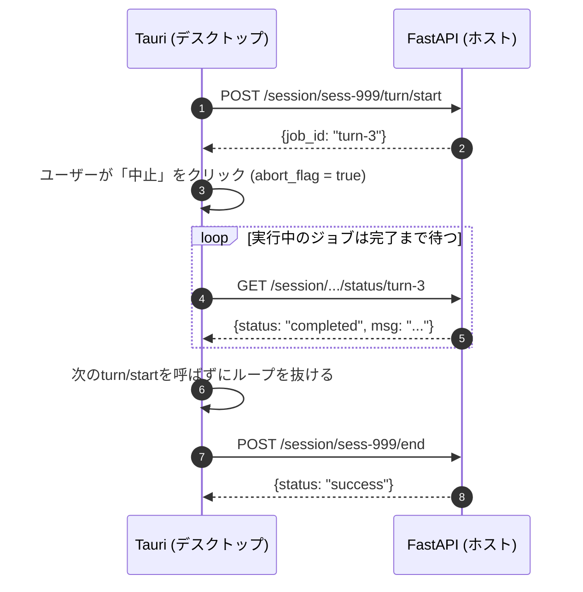
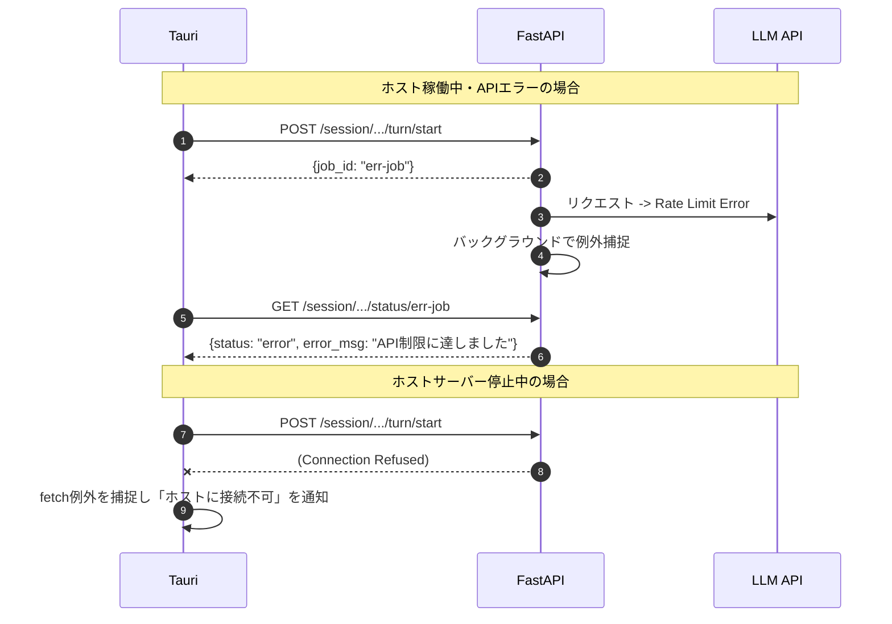

# AI Discussion App System Specification (SPEC)

## 1. プロジェクト概要
本プロジェクトは、複数のAIエージェントに特定のテーマについて議論させるためのデスクトップアプリケーションである。
フロントエンド（UIと状態・履歴管理）を Tauri (React + TypeScript) で構築し、重いAI処理（LLM、RAG、メモリ管理）を別サーバーの FastAPI (Python + LangChain + Qdrant) に委譲するアーキテクチャを採用する。

## 2. アーキテクチャと責務の分離
* **クライアント (Tauri/React):**
    * UIの描画、ペルソナ（役割・タスク）の設定と保存。
    * FastAPIへのリクエスト送信とポーリング制御（ストリーミングは使用しない）。
    * SQLiteを使用した議論履歴のローカル保存（ホスト側には履歴を永続化しない）。
    * ホストサーバーのIPアドレス管理。
* **ホストサーバー (FastAPI/LangChain/Qdrant):**
    * ステートレスなAPIサーバー（セッション中のメモリのみオンメモリで保持、DBは持たない）。
    * `BackgroundTasks` を用いた非同期のLLM生成処理およびRAGのチャンキング処理。
    * LangChainを用いたエージェントの会話生成と、トークン長制限を回避するためのコンテキスト要約（`ConversationSummaryMemory`等を利用）。
    * Qdrant（Dockerで稼働）へのベクトルデータ格納と検索。

## 3. データベーススキーマ (Tauri側 SQLite)
クライアント側の `tauri-plugin-sql` を使用して構築する。

* **`personas` テーブル** (エージェントの設定)
    * `id` (TEXT/UUID, PK)
    * `name` (TEXT): エージェント名
    * `role` (TEXT): 役割（例：批判的なエンジニア）
    * `task` (TEXT): タスク・指示内容
* **`sessions` テーブル** (議論のセッション履歴)
    * `id` (TEXT/UUID, PK)
    * `title` (TEXT): 議論のタイトルや日時
    * `created_at` (DATETIME)
* **`messages` テーブル** (個々の発言履歴)
    * `id` (TEXT/UUID, PK)
    * `session_id` (TEXT, FK): `sessions.id`
    * `theme` (TEXT): 議論中のテーマ
    * `agent_name` (TEXT): 発言したエージェント名
    * `content` (TEXT): 発言内容
    * `turn_order` (INTEGER): 発言順序
    * `created_at` (DATETIME)

## 4. API インターフェース仕様 (FastAPI)

### 4.1 議論セッション管理 API
| Method | Endpoint | Request Body | Response Body | 備考 |
| :--- | :--- | :--- | :--- | :--- |
| POST | `/api/session/start` | `{ "themes": string[], "personas": object[], "history": object[] }` | `{ "session_id": string }` | オンメモリにセッション空間を作成 |
| POST | `/api/session/{session_id}/turn/start` | なし | `{ "job_id": string }` | バックグラウンドで生成開始 |
| GET | `/api/session/{session_id}/turn/status/{job_id}` | なし | `{ "status": "processing" \| "completed" \| "error", "agent_name"?: string, "message"?: string, "is_theme_end"?: boolean, "error_msg"?: string }` | ポーリング用 |
| POST | `/api/session/{session_id}/summarize/start` | なし | `{ "job_id": string }` | テーマ終了時のまとめ生成 |
| GET | `/api/session/{session_id}/summarize/status/{job_id}`| なし | `{ "status": "processing" \| "completed" \| "error", "summary_text"?: string, "error_msg"?: string }` | まとめポーリング用 |
| POST | `/api/session/{session_id}/end` | なし | `{ "status": "success" }` | オンメモリのセッションを破棄 |

### 4.2 RAG データ管理 API (タグベース)
| Method | Endpoint | Request Body | Response Body | 備考 |
| :--- | :--- | :--- | :--- | :--- |
| POST | `/api/rag/init` | `{ "tag": string }` | `{ "status": "success" }` | Qdrantの該当タグデータを全削除 |
| POST | `/api/rag/add` | `{ "tag": string, "text": string }` | `{ "job_id": string }` | チャンキング＆エンベディング開始 |
| GET | `/api/rag/status/{job_id}` | なし | `{ "status": "processing" \| "completed" \| "error" }` | 追加処理のポーリング用 |

## 5. 処理フロー（シーケンス図）

### 5.1 RAGデータの初期化と追加

### 5.2 議論の進行（開始〜ターンのループ〜まとめ）

### 5.3 議論の中止

### 5.4 エラーハンドリング

